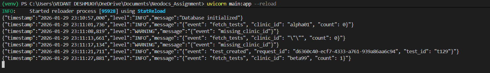

# Medical Test Records API

## Technical Decisions as asked in the Assignment

### 1. Why did you choose this framework?

I opted for `FastAPI` primarily for its high-performance ASGI foundation and clean routing, even while adhering to the "no auto-validation" constraint. Although FastAPI offers automatic validation and dependency injection, I deliberately avoided those features. I worked directly with Request and Response objects and implemented custom validation and logging logic without using Pydantic. This let me keep the code explicit and compliant with the “no auto-validation” requirement, while still benefiting from FastAPI’s performance, clean routing, and ASGI support. Essentially, FastAPI is used only for HTTP handling, and all core logic is fully controlled by the application code.

---

### 2. Where can this system fail?

- SQLite Concurrency Limits  
  SQLite uses file-level locking, making it vulnerable to `database is locked` errors under high-frequency concurrent writes.

- Manual Validation Risk  
  With no strict schema enforcer like Pydantic, the system is more exposed to malformed payloads or edge-case strings that automatic validation would typically catch.

---

### 3. How would you debug a data inconsistency issue?

To debug data inconsistencies, the system uses correlation-based logging:

- Every request is assigned a unique UUID.
- This UUID is propagated through logs from request receipt to SQL commit or rollback.
- Suspicious records can be traced by correlating logs with the `created_at` timestamps stored in the database.

---

### 4. What would change in production vs local?

In a production environment, the system would evolve beyond its local-first design to address scalability, reliability, and observability concerns.

The database layer would migrate from SQLite to PostgreSQL to support true concurrent writes through row-level locking and a client-server architecture. As the dataset grows, an `index on clinic_id` would be introduced to optimize query performance, reducing lookups from linear scans to logarithmic time.

Configuration management would move away from local .env files toward a managed secrets solution such as AWS Secrets Manager, eliminating configuration drift and improving security across environments.

For observability, the existing structured JSON logs would be shipped to a centralized logging platform like ELK or Datadog, enabling cross-service tracing, alerting, and long-term log retention.

Finally, database access would transition to an asynchronous driver (such as aiosqlite) to ensure database I/O does not block the FastAPI event loop under high load, preserving throughput and responsiveness.

---

### 5. Design Choice: Conflict over Idempotency

Duplicate handling follows Option A: `409 Conflict`.

In healthcare data pipelines, duplicate `test_id` values often indicate upstream system bugs or accidental resubmissions with modified payloads. By explicitly rejecting duplicates:

- Clients are forced to resolve collisions intentionally.
- The system avoids silently ignoring writes.
- Data integrity is preserved through a fail-fast approach.

---

Below is a screenshot showing the logs generated when POST and GET requests are made to `http://127.0.0.1:8000/tests`.



## Setup and Installation

### Environment Configuration

Create a `.env` file in the project root:

```env
DATABASE_URL=records.db
```

### Install Dependencies

```bash
pip install fastapi uvicorn python-dotenv
```

### Execution

```bash
uvicorn main:app --reload
```

---

## API Endpoints

### `POST /tests`

Ingests a single medical test record.

Responses:

- `200 OK` Record inserted successfully
- `409 Conflict` Duplicate `test_id`
- `400 Bad Request` Invalid or malformed data

---

### `GET /tests?clinic_id=<id>`

Retrieves all test records for a specific clinic.

Responses:

- `200 OK` Returns a list of records
- `200 OK` Returns an empty list `[]` if no records exist , also a log is printed with count of resultant array
- `400 Bad Request` Missing `clinic_id` parameter
